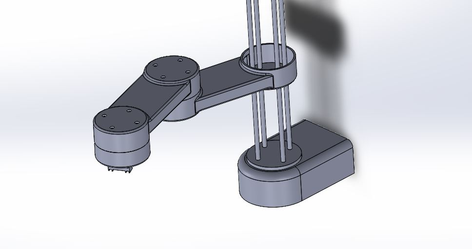

***This is still a work in progress and there is no estimated project finish time***

#Welcome to robotic arm project

My name is Jameel Jamous. I am attending the University of California, San Diego to obtain a B.S. in Electrical Engineering. This is a self project that I have started in summer 2022. The arm is still in development.

The mechanical design for the arm based off of SCARA robotic arms where the Z-axis is a prismatic joint and X and Y axis are based off of revolute joints.

